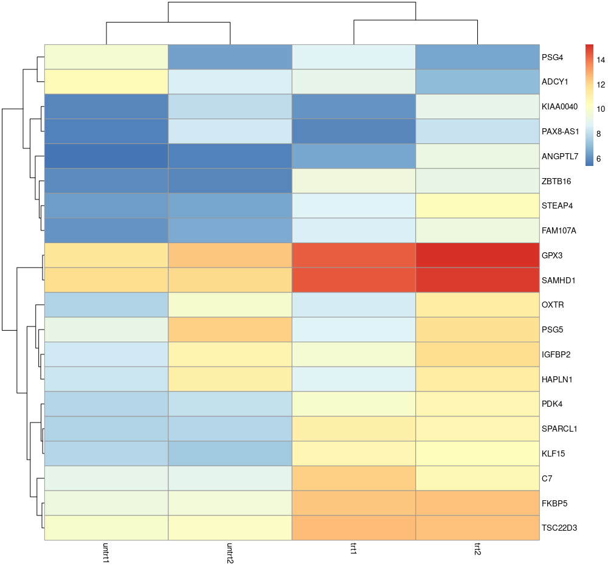
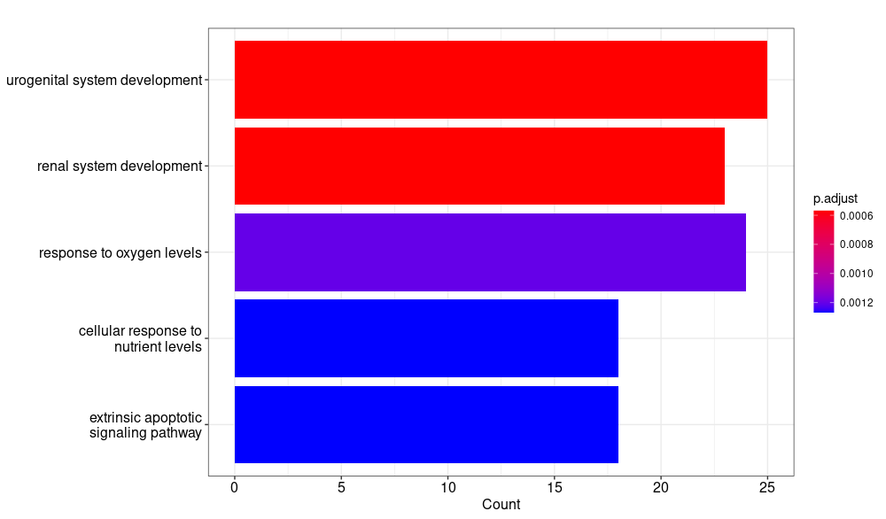

# BENG183 HW3 Tutorial

#### Introduction

Welcome to HW3 tutorial on executing an RNA-seq analysis pipeline. RNA-sequencing (RNA-seq) has revolutionized our ability to analyze gene expression profiles in a high-throughput manner. This tutorial is designed to guide you step by step through the processes of quality control, alignment, and quantification of RNA-seq data using popular bioinformatics tools.

#### Objectives

By the end of this tutorial, you should be able to:

1. Understand the importance of each step in the RNA-seq analysis pipeline.
2. Perform quality control checks on raw sequencing data using FastQC.
3. Trim and filter raw sequencing reads using Fastp.
4. Align the processed reads to a reference genome using STAR.
5. Quantify gene expression levels using FeatureCounts.

#### Outline

1. **Setting up the environment:**
   - Installing and setting up necessary tools
2. **Quality Control with FastQC:**
   - Running FastQC on raw sequencing data
   - Interpreting FastQC reports
3. **Reads Trimming and Filtering with Fastp:**
   - Running Fastp to clean up raw sequencing data
   - Verifying the quality of trimmed reads with FastQC
4. **Aligning Reads to the Reference Genome with STAR:**
   - Setting up the reference genome
   - Running STAR for aligning RNA-seq reads
   - Interpreting the STAR alignment summary
5. **Gene Expression Quantification with FeatureCounts:**
   - Running FeatureCounts to quantify gene expression levels
   - Interpreting the output of FeatureCounts
6. **Differential Expression Analysis and Functional Annotation (BONUS):**
   - Using DESeq2 to identify the differentially expressed genes (DEGs)
   - Generating functional annotation with clusterProfiler


# Let's begin!

## 1. Setting up the environment and downloading data

### 1.1 Setting up conda environment

Note: This part can be skipped if you have done environment set up in previous assignments.

To ensure reproducibility and consistency across different setups, it's recommended to use Conda, a package manager that can also handle virtual environments. In this section, we'll guide you through creating a Conda environment and installing the necessary tools for our RNA-seq pipeline.

```bash
# create a new environment

conda create -n beng183

# activate the environment

conda activate beng183

# install all required packages

conda install -c bioconda fastqc fastp star samtools subread
```

In the commands above, we're not specifying any version, allowing Conda to select versions that are compatible with each other.

If you encounter any issues with the default installation commands, we provide an alternative approach. A tested [environment.yml](https://github.com/Gaoyuan-Li/BENG183_HW3_2023Fall/blob/main/environment.yml) file is available in the repository, which has been confirmed to work on Ubuntu 22.04:

```bash
conda env create -f environment.yml
```

Note: Ensure the `prefix` in the `environment.yml` file points to the appropriate path on your system. Adjust it as necessary.

By following the steps above, you'll have a dedicated environment set up with all the tools required for the RNA-seq analysis pipeline. This ensures that the analysis is both reproducible and insulated from other software on your system

### 1.2  Downloading and Preparing the Sequencing Data

#### 1.2.1 Options for Downloading the Data

- **From Google Drive**: 

  You can download the sequencing files directly from this [Google Drive link](https://drive.google.com/file/d/12qNoEYrJk6xbInxLHX3jOZXimvWLVSB6/view?usp=sharing).

- **From GitHub**: 

  Alternatively, the data is available in this [GitHub repository under `data_chrX`](https://github.com/Gaoyuan-Li/BENG183_HW3_2023Fall/tree/main/data_chrX). Note that due to GitHub's 100MB file size limit, each file has been compressed. Download each `.gz` file and gather them in a folder named `data_chrX`.

#### 1.2.2 Preparing the Data

Given the size of RNA-seq files, they are often compressed using the gzip, resulting in a `.gz` extension.

To decompress a gzip-compressed file, you can use the `gzip` command with the `-d` option, for example:

```
gzip -d chrX.fa.gz
```

After running this command, you'll have the decompressed file ready for further processing in the RNA-seq pipeline.

Once the files are downloaded and decompressed, you can proceed with quality checks, trimming, alignment, and other steps in the RNA-seq analysis workflow.

Note: In this tutorial, only chrX.fa.gz and chrX.gtf.gz need to be decompressed.

## 2. Quality Control with FastQC

### 2.1 Why Quality Control is Crucial for RNA-seq Data

Before processing and analyzing RNA-seq data, it's essential to assess its quality. High-quality data will lead to more accurate downstream analyses, whereas low-quality data can introduce biases and inaccuracies. Quality control (QC) helps identify issues such as sequencing errors, contamination, and biases, allowing for informed decisions on further data processing steps.

### 2.2 **Running FastQC on Raw Sequencing Data**

```bash
mkdir fastqc

fastqc -o fastqc/ -t 16 data_chrX/ERR188044_chrX_1.fastq.gz
```

- `fastqc`: Calls the FastQC program.
- `-o fastqc/`: Specifies the output directory where FastQC will save its results. In this case, it's a directory named "fastqc."
- `-t 16`: Tells FastQC to use 16 threads for the analysis, speeding up the process.
- `data_chrX/ERR188044_chrX_1.fastq.gz`: Specifies the input file, which is a FASTQ file containing the raw sequencing reads.

### 2.3 **Interpreting FastQC Reports**

After running FastQC, you'll get a `.html` report that provides various metrics and visualizations to assess the quality of your RNA-seq data:

1. **Basic Statistics**: Provides general information about the dataset, like the total number of sequences, sequence length, and the overall assessment of data quality.
2. **Per Base Sequence Quality**: Displays the quality scores across all bases at each position in the reads. Ideally, most of the plot should be in the green region. Yellow or red regions suggest poor quality.
3. **Per Tile Sequence Quality**: If using Illumina sequencing, this checks for tile-specific issues. Variations might indicate a problem during sequencing.
4. **Per Sequence Quality Scores**: Shows the distribution of average quality scores per read. A left-skewed distribution (towards higher quality scores) is desirable.
5. **Per Base Sequence Content**: Checks if the proportion of each base (A, T, C, G) changes over the length of the reads. Consistent base proportions are expected unless there's a known reason for variation.
6. **Per Sequence GC Content**: Compares the GC content distribution in your reads to a theoretical distribution. A significant deviation might indicate contamination or a biased library.
7. **Per Base N Content**: Reports the percentage of bases at each position for which a base could not be determined.
8. **Sequence Length Distribution**: Indicates the range of sequence lengths in the dataset.
9. **Sequence Duplication Levels**: Reports the relative level of duplication for every sequence in the set.
10. **Overrepresented Sequences**: Lists sequences that appear more often than expected.
11. **Adapter Content**: Checks for the presence of adapter sequences, which can occur when the insert is shorter than the read length.

## 3. Reads Trimming and Filtering with Fastp

### 3.1 Introduction to Trimming and Fastp

After initial quality control checks, raw sequencing data often requires preprocessing to improve the quality of the reads. This preprocessing step, known as "trimming," involves removing low-quality bases, sequencing adapters, and other unwanted sequences from the raw reads.

Fastp is a versatile tool that not only trims the reads but also provides additional filtering options. It's designed to handle both single-end and paired-end data efficiently. By using Fastp, researchers can ensure that only high-quality reads proceed to the alignment stage, thus improving the accuracy of downstream analyses.

### 3.2 Running Fastp to Clean Up Raw Sequencing Data

```bash
mkdir fastp

fastp -i data_chrX/ERR188044_chrX_1.fastq.gz -I data_chrX/ERR188044_chrX_2.fastq.gz -o data_chrX/ERR188044_chrX_1_clean.fastq.gz -O data_chrX/ERR188044_chrX_2_clean.fastq.gz -j fastp/fastp.json -h fastp/fastp.html
```

- `fastp`: Calls the Fastp program.
- `-i data_chrX/ERR188044_chrX_1.fastq.gz`: Specifies the input file for the first read in paired-end data.
- `-I data_chrX/ERR188044_chrX_2.fastq.gz`: Specifies the input file for the second read in paired-end data.
- `-o data_chrX/ERR188044_chrX_1_clean.fastq.gz`: Specifies the output file for the trimmed and cleaned first read.
- `-O data_chrX/ERR188044_chrX_2_clean.fastq.gz`: Specifies the output file for the trimmed and cleaned second read.

## 4. Aligning Reads to the Reference Genome with STAR

### 4.1 Understanding the Significance of Read Alignment

After the preprocessing steps, the next crucial step in the RNA-seq pipeline is aligning the reads to a reference genome. This allows us to determine the origin of each read in the genome and subsequently quantify gene expression levels. STAR (Spliced Transcripts Alignment to a Reference) is a widely used tool for this purpose, known for its speed and accuracy, especially when dealing with RNA-seq data that contains spliced transcripts.

### 4.2 Checking if STAR is Installed Properly

Before we start the alignment, it's essential to ensure that STAR is correctly installed and accessible:

```
# check if STAR has been successfully installed.

STAR -h 
```

If STAR is installed correctly, it will display a list of its options and parameters. If not, you'll need to troubleshoot the installation.

### 4.3 Build Index for Reference Genome

Before aligning reads, STAR requires an indexed version of the reference genome. Indexing makes the alignment process faster and more efficient. Here's how you can build this index:

```
# build index

STAR --runThreadN 16 --runMode genomeGenerate --genomeDir chrX_STAR_index/ --genomeFastaFiles data_chrX/chrX.fa --sjdbGTFfile data_chrX/chrX.gtf --sjdbOverhang 100
```

- `--runThreadN 16`: Specifies that STAR should use 16 threads, speeding up the indexing process.
- `--runMode genomeGenerate`: Tells STAR that we're in "genome index generation" mode.
- `--genomeDir chrX_STAR_index/`: Specifies the directory where the genome index will be saved.
- `--genomeFastaFiles data_chrX/chrX.fa`: Points to the FASTA file containing the reference genome sequence.
- `--sjdbGTFfile data_chrX/chrX.gtf`: Provides the path to the GTF file, which contains annotated genes and their locations in the genome. This annotation helps STAR recognize known splice junctions.
- `--sjdbOverhang 100`: Specifies the length of the overhang for splice junctions.

After this step, the `chrX_STAR_index/` directory will contain several files that constitute the genome index. With the index in place, you're now set to align your RNA-seq reads to the reference genome using STAR.

### 4.4 Aligning Reads to the Reference Genome Using STAR

With the indexed reference genome in place, you can now align your RNA-seq reads to the reference. This alignment process will map each read to its most likely origin in the genome, taking into account possible splicing events.

```
# Reads mapping

STAR --runThreadN 16 --genomeDir chrX_STAR_index/ --readFilesIn data_chrX/ERR188044_chrX_1_clean.fastq data_chrX/ERR188044_chrX_2_clean.fastq --outSAMtype BAM SortedByCoordinate --outFileNamePrefix ./ERR188044_BAM/ERR188044_STAR_
```

- `--runThreadN 16`: Specifies that STAR should use 16 threads, which will speed up the alignment process.
- `--genomeDir chrX_STAR_index/`: Points to the directory containing the indexed reference genome, which we created in the previous step.
- `--readFilesIn data_chrX/ERR188044_chrX_1_clean.fastq data_chrX/ERR188044_chrX_2_clean.fastq`: Specifies the cleaned and trimmed paired-end reads to be aligned. The first file corresponds to the forward reads, and the second file to the reverse reads.
- `--outSAMtype BAM SortedByCoordinate`: Instructs STAR to output the alignment results in BAM format (a binary version of the Sequence Alignment/Map format), sorted by genomic coordinates. This is useful for many downstream applications, including visualization.
- `--outFileNamePrefix ./ERR188044_BAM/ERR188044_STAR_`: Specifies the prefix for all output files. In this case, the alignment files will be saved in the `ERR188044_BAM/` directory with the prefix `ERR188044_STAR_`.

**Expected Output**:

`ERR188044_STAR_Aligned.sortedByCoord.out.bam`: This is the main output file, containing the aligned reads in BAM format, sorted by genomic coordinates.

`ERR188044_STAR_Log.out`: A log file that provides general information about the alignment process, such as the number of reads processed, the number of uniquely aligned reads, and the number of reads that aligned to multiple locations.

`ERR188044_STAR_Log.final.out`: A summary of the alignment statistics, useful for a quick overview of the alignment's success.

`ERR188044_STAR_Log.progress.out`: A file that logs the progress of the alignment in real-time. Useful for long runs.

`ERR188044_STAR_SJ.out.tab`: A file listing the splice junctions detected during the alignment. This can be useful for detecting novel splicing events or comparing to known annotations.

## 5. Gene Expression Quantification with FeatureCounts

### 5.1 Introduction to Quantification

After successfully aligning RNA-seq reads to a reference genome, the next critical step is quantifying gene expression levels. This process involves counting how many reads align to each gene, which provides a measure of that gene's expression level in the sample. FeatureCounts is a fast and accurate program for this purpose, capable of processing both single-end and paired-end RNA-seq data.

### 5.2 Running FeatureCounts for Gene Expression Quantification

```
mkdir featureCounts

featureCounts -p -a data_chrX/chrX.gtf -T 16 -o featureCounts/ERR188044_counts.txt ERR188044_BAM/ERR188044_STAR_Aligned.sortedByCoord.out.bam
```

- `-p`: Specifies that the input data is paired-end. FeatureCounts will count fragments (pairs of reads) instead of individual reads.
- `-a data_chrX/chrX.gtf`: Provides the path to the GTF file, which contains annotated genes and their locations in the genome.
- `-T 16`: Instructs FeatureCounts to use 16 threads, which will speed up the counting process.
- `-o featureCounts/ERR188044_counts.txt`: Specifies the output file where the gene counts will be saved.
- `ERR188044_BAM/ERR188044_STAR_Aligned.sortedByCoord.out.bam`: Specifies the input BAM file, which contains the aligned reads.

**Expected Output**:

After running FeatureCounts, you will get the following files:

1. `featureCounts/ERR188044_counts.txt`: This is the main output file containing the count of aligned reads (or fragments for paired-end data) for each gene in the provided GTF file.
2. `featureCounts/ERR188044_counts.txt.summary`: A summary file that provides an overview of the counting process, including the number of successfully assigned reads, the number of reads that failed to be assigned, and the reasons for assignment failure (e.g., unmapped, ambiguous mapping).

By examining the `ERR188044_counts.txt` file, you will see a table where each row represents a gene from the GTF file, and each column contains information about that gene, such as its ID, chromosome, start and end positions, strand, length, and the count of aligned reads.

With the gene expression quantified, you can now proceed to downstream analyses, such as differential expression analysis, clustering, or pathway analysis, depending on your research questions.

## 6. Differentially expressed genes (BONUS)

### 6.1 Downloading data

Please download the raw_counts.csv from [data_DEG](https://github.com/Gaoyuan-Li/BENG183_HW3_2023Fall/tree/main/data_DEG) as input for the following analysis.

### 6.1 Differential Expression Analysis with DESeq2

Differential Expression Analysis is a method to identify genes whose expression levels differ significantly across experimental conditions. DESeq2 is a popular R package designed for this purpose.

```R
# -----------------------------
# Load Libraries and Data Preparation
# -----------------------------
library(DESeq2)

# Read in the raw count data and extract the columns containing count data
raw_count <- read.csv('./raw_counts.csv')
count_data <- raw_count[,2:5]
row.names(count_data) <- raw_count[,1]

# Define experimental conditions and prepare sample information
condition <- factor(c('trt','trt','untrt','untrt'), levels = c('trt','untrt'))
col_data <- data.frame(row.names = colnames(count_data), condition)


# -----------------------------
# Differential Expression Analysis
# -----------------------------
# Create DESeq dataset object, filter out low count genes, and perform differential expression analysis
dds <- DESeqDataSetFromMatrix(countData = count_data, colData = col_data, design = ~ condition)
dds_filter <- dds[rowSums(counts(dds)) > 1, ]
dds_out <- DESeq(dds_filter)

# Extract and order the results, and identify differentially expressed genes based on criteria
res <- results(dds_out)
res <- res[order(res$padj),]
diff_gene <- subset(res, res$padj < 0.01 & (res$log2FoldChange > 1 | res$log2FoldChange < -1))

# Save the differentially expressed genes to a CSV file
write.csv(diff_gene, file = 'DEG.csv')


# -----------------------------
# Data Visualization
# -----------------------------
# Load necessary libraries and transform count data for visualization
library(genefilter)
library(pheatmap)
rld <- rlogTransformation(dds_out, blind = F)

# Identify and extract top variable genes for visualization
topVarGene <- head(order(rowVars(assay(rld)), decreasing = TRUE), 20)
mat <- assay(rld)[topVarGene, ]

# Generate a heatmap of the top variable genes
pheatmap(mat)
```



### 6.2 Functional Annotation with clusterProfiler

Functional annotation helps interpret the biological significance of the differentially expressed genes.

```R
# -----------------------------
# Functional Annotation and Enrichment Analysis
# -----------------------------

# Load necessary libraries for enrichment analysis
library(clusterProfiler)
library(DOSE)
library(org.Hs.eg.db)

# Read the differentially expressed genes and extract gene symbols
sig.gene <- read.csv(file="DEG.csv")
gene <- sig.gene[,1]

# Convert gene symbols to other identifiers, including ENTREZID and ENSEMBL
gene.df <- bitr(gene, fromType = "SYMBOL", 
              toType = c("ENTREZID","ENSEMBL"),
              OrgDb = org.Hs.eg.db)

# Extract unique ENTREZIDs for enrichment analysis
genelist <- gene.df$ENTREZID
gene_list <- genelist[!duplicated(genelist)]

# Perform Gene Ontology (GO) enrichment analysis
go <- enrichGO(gene_list, OrgDb = org.Hs.eg.db, ont='ALL', pAdjustMethod = 'BH', pvalueCutoff = 0.05, 
               qvalueCutoff = 0.2, keyType = 'ENTREZID')

# Display the number of enriched terms in each GO category: Biological Process (BP), Cellular Component (CC), and Molecular Function (MF)
dim(go[go$ONTOLOGY=='BP',])
dim(go[go$ONTOLOGY=='CC',])
dim(go[go$ONTOLOGY=='MF',])

# Visualize the enriched GO terms using bar and dot plots
barplot(go, showCategory=5, drop=T)
#dotplot(go, showCategory=5)
```


